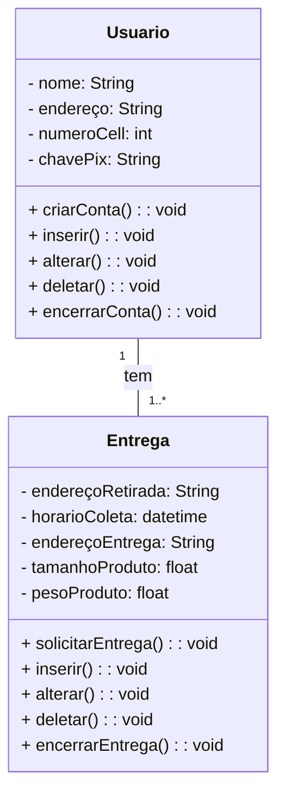

# EngenhariaDeSoftwareII-2.2023-Prof_AnaCelia
Repositorio destinado a entrega das atividades desenvolvidas em sala de aula

[Diagrama de Atividades](DiagramaAtividade-RapidLogistica-17-10-2023.png)
